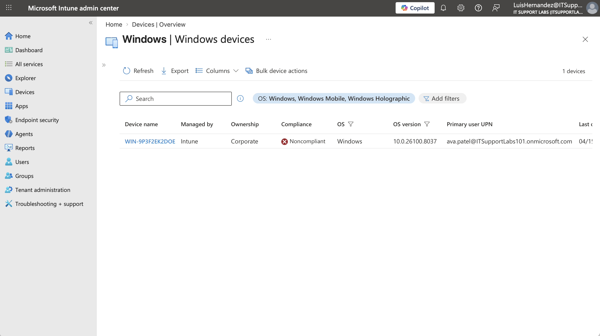
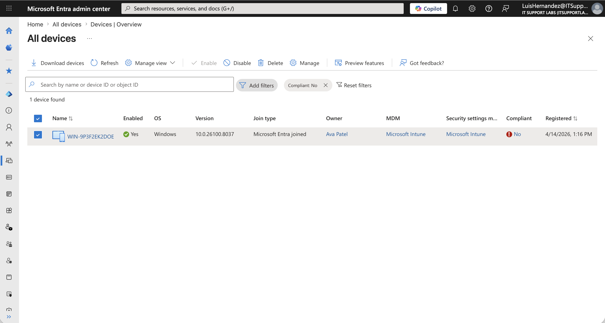
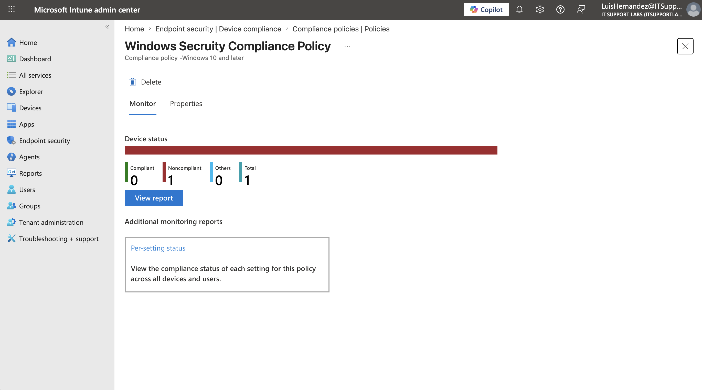
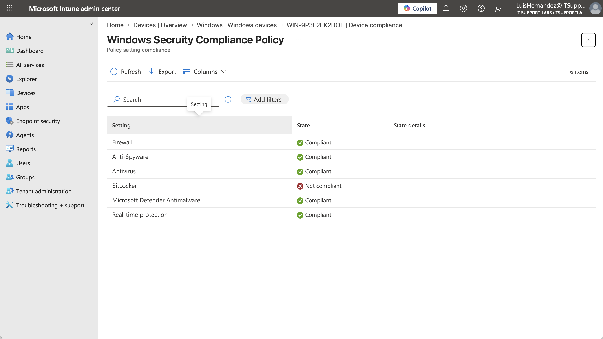
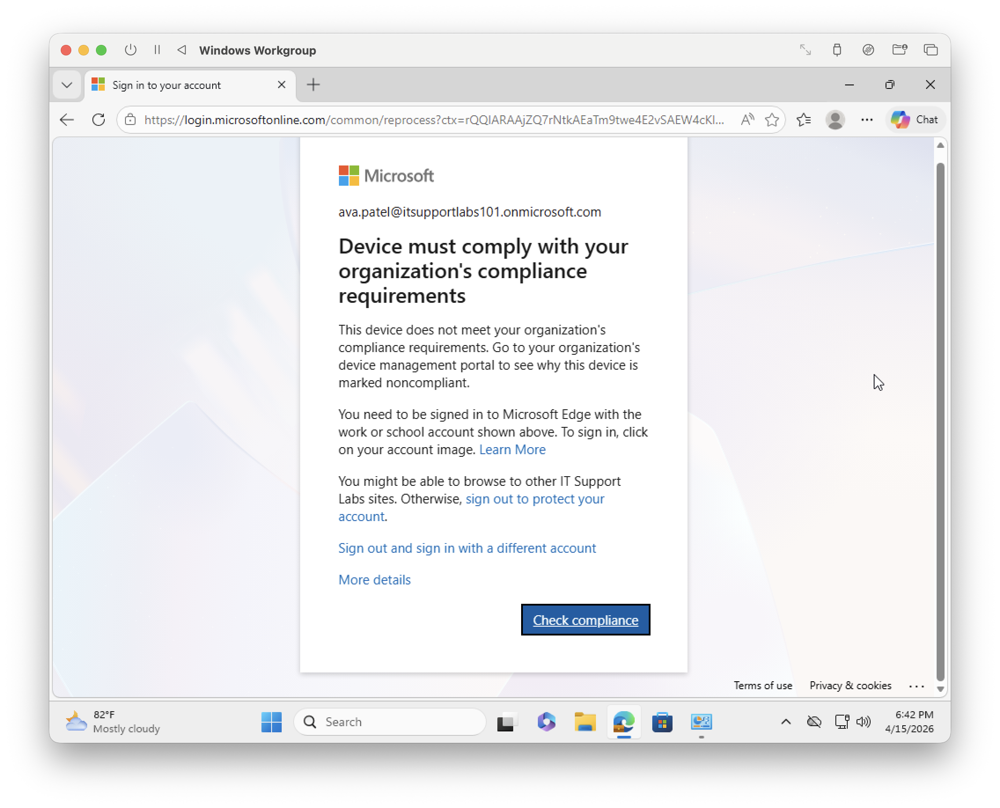

# Microsoft Intune Device Enrollment, Compliance & Conditional Access Troubleshooting Lab

## Objective
Simulate and troubleshoot a real-world Microsoft Intune access control issue by enrolling a Windows 11 device, applying configuration and compliance policies, enforcing Conditional Access based on device compliance, intentionally causing a compliance failure, and restoring access through remediation.

---

## Lab Environment 
- Microsoft 365 Tenant
- Microsoft Intune admin center
- Microsoft Entra admin center
- Windows 11 Virtual Machine

---

## Skills Demonstrated
- Microsoft Intune device enrollment
- Windows configuration profile deployment
- Device compliance policy creation
- Conditional Access administration
- Access control troubleshooting
- Endpoint remediation

---

## Steps

### 1. Device Enrollment into Microsoft Intune
Created a security group titled `Intune-Windows-Users` in Microsoft Intune and added a licensed test user, `Ava Patel`. Enrolled a Windows 11 device into Microsoft Intune by connecting the user account through “Access work or school” and joining the device to Microsoft Entra ID. Verified successful enrollment by confirming the device appeared in both Microsoft Entra ID and Intune with compliant status.

---

### 2. Applied a Windows Configuration Profile
Deployed a Windows configuration profile using Intune’s Settings Catalog to enforce baseline security settings on enrolled devices. Configured settings such as sign-in behavior on resume and device sleep timeout to align with organizational security standards. Assigned the profile to the group and verified successful deployment by confirming policy status as Succeeded on the target device.

---

### 3. Created a Device Compliance Policy
Created a Windows device compliance policy in Microsoft Intune to enforce security standards required for device trust. Configured requirements including `BitLocker encryption`, `Firewall`, `Antivirus`, `Antispyware`, `Microsoft Defender Antimalware`, and `real-time protection`. Assigned the policy to the group and validated compliance by confirming the enrolled device reported as Compliant, preparing it for Conditional Access

---

### 4. Created a Conditional Access Policy in Report-Only Mode and Enforced Conditional Access Based on Device Compliance
Created a Conditional Access policy in Microsoft Entra ID to require compliant devices for accessing Office 365 resources. Configured the policy to target the group and applied it to Office 365 cloud apps. Set the access control to `Require compliant device` and initially enabled the policy in `Report-only mode` to safely evaluate its impact.

Performed test sign-ins using the enrolled user account and reviewed sign-in logs to confirm the policy was triggered and evaluated successfully. After validation, switched the policy from Report-only to `On` to enforce access control based on device compliance.

---

### 4. Simulated a Noncompliant Device Condition
Intentionally disabled BitLocker encryption on the device to simulate a noncompliant endpoint. After forcing a device sync, the device was marked as `Noncompliant` in Microsoft Intune due to failing the BitLocker requirement defined in the compliance policy. Verified the noncompliant state in both Intune and Microsoft Entra ID, confirming BitLocker as the root cause at the policy setting level. Attempted to access Microsoft 365 resources, where Conditional Access enforcement successfully blocked access, requiring the device to meet compliance requirements before access was granted.

---

### 5. Remediated Device Compliance and Restored Access
Re-enabled the required endpoint security setting, initiated policy synchronization, and verified the device returned to a compliant state. Retested Microsoft 365 access and confirmed Conditional Access allowed the user back into protected resources.

## Key Takeaways
- Intune compliance and Entra Conditional Access work together to enforce secure access
- A user can authenticate successfully but still be blocked from resources if the device is noncompliant
- Testing Conditional Access in report-only mode reduces risk before enforcement
- Group-based policy targeting is cleaner and more scalable than per-user assignments
